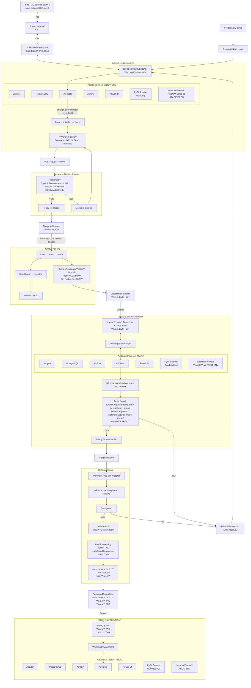

# Basic Overview: Workflows in All Environments

```mermaid
graph TD
    INIT_COMMIT["If INITIAL commit (NEW): <br>main branch 0.0.1.dev0"]
    INIT_JUSTRELEASED["If just released<br>x.y.z"]
    INIT_PRS_BEFORE_RELEASE["If PRs before release <br>main branch x.y.z.devX"]
    INIT_NEWISSUE[Create New Issue<br>]
    INIT_STARTISSUE[Assign & Start Issue]
    INFO_RELEASE_BLOCKED[Release is blocked. <br>Must resolve.]

    subgraph DEV ENVIRONMENT
        DEV_Codespaces[CODESPACES/LOCAL: <br>Working Environment]

        subgraph Additional Tools in DEV ENV
            DEV_Jupyter[Jupyter]
            DEV_Postgres[PostgreSQL]
            DEV_TOOLS[All Tools]
            DEV_Airflow[Airflow]
            DEV_Tool[Power BI]
            DEV_PyPI[PyPI Source: <br>PyPI.org]
            DEV_Network[Network/Firewall: <br>**NOT** same as STAGE/PROD]
        end

        DEV_Codespaces <--> DEV_TOOLS
        DEV_ISSUE_BRANCH[Branch linked to an Issue]
        DEV_ISSUE_WORK[**Work on Issue**<br>Features, Hotfixes, Tests, Reviews]
        DEV_TOOLS --> |Branch off from main <br>x.y.z.devX| DEV_ISSUE_BRANCH
        DEV_ISSUE_BRANCH <--> DEV_ISSUE_WORK
    end

    INIT_COMMIT <--> |OR| INIT_JUSTRELEASED
    INIT_JUSTRELEASED <--> |OR| INIT_PRS_BEFORE_RELEASE
    INIT_PRS_BEFORE_RELEASE <--> DEV_Codespaces
    INIT_NEWISSUE --> INIT_STARTISSUE
    INIT_STARTISSUE --> DEV_Codespaces
    INFO_PR[Pull Request Review]
    DEV_ISSUE_WORK --> INFO_PR
    INFO_PR --> GH_ACT_REQS

    subgraph Review in GitHub Actions
        GH_ACT_REQS[Tests Pass? <br>Explicit Requirements met? <br>At least one Human Review Approved?]
        GH_ACT_MERGE_YES[Ready for merge!]
        GH_ACT_MERGE_NO[Merge is blocked]

        GH_ACT_REQS --> |NO| GH_ACT_MERGE_NO
        GH_ACT_REQS --> |YES| GH_ACT_MERGE_YES
    end

    MERGE_BRANCH[Merge & Update <br>**main** Branch]

    GH_ACT_MERGE_NO --> DEV_ISSUE_WORK
    GH_ACT_MERGE_YES --> MERGE_BRANCH
    MERGE_BRANCH --> |Automatic GH Actions Trigger| GH_ACT_2_LATEST_MAIN

    subgraph GitHub Actions
        GH_ACT_2_LATEST_MAIN[Latest **main** branch]
        GH_ACT_2_VERSION_BUMP["Bump Version on **main** Branch<br>From: *x.y.z.devX*<br>To: **a.b.c.dev(X+1)**"]
        GH_ACT_2_DELETED_HEAD_BRANCH[Head branch is deleted]
        GH_ACT_2_CLOSED_ISSUE[Issue is closed]

        GH_ACT_2_LATEST_MAIN --> GH_ACT_2_VERSION_BUMP
        GH_ACT_2_LATEST_MAIN --> GH_ACT_2_DELETED_HEAD_BRANCH
        GH_ACT_2_DELETED_HEAD_BRANCH --> GH_ACT_2_CLOSED_ISSUE

    end

    INFO_LATEST_MAIN["Latest main Branch<br>**a.b.c.dev(X+1)**"]

    GH_ACT_2_VERSION_BUMP --> INFO_LATEST_MAIN
    INFO_LATEST_MAIN --> |Deploy| STAGE_MAIN_LATEST

    subgraph STAGE ENVIRONMENT
        STAGE_MAIN_LATEST["Latest **main** Branch in STAGE ENV<br>**a.b.c.dev(X+1)**"]
        STAGE_REVIEW_ACTIVITY[All necessary kinds of tests and reviews]
        STAGE_REVIEW_REQS[Tests Pass? <br>Explicit Requirements met? <br>At least one Human Review Approved? <br>Network-Settings make sense?<br>Ready for PROD?]
        STAGE_RELEASE_YES[Ready for RELEASE!]
        STAGE_WORK_ENV[Working Environment]

        subgraph Additional Tools in STAGE
            STAGE_JUPYTER[Jupyter]
            STAGE_Postgres[PostgreSQL]
            STAGE_Airflow[Airflow]
            STAGE_TOOLS[All Tools]
            STAGE_TOOL[Power BI]
            STAGE_PyPI[PyPI Source: <br>Bundescloud]
            STAGE_Network[Network/Firewall: <br>**SAME** as PROD ENV]
        end

        STAGE_WORK_ENV <--> STAGE_TOOLS
        STAGE_MAIN_LATEST <--> STAGE_WORK_ENV
        STAGE_TOOLS --> STAGE_REVIEW_ACTIVITY
        STAGE_REVIEW_ACTIVITY --> STAGE_REVIEW_REQS
        STAGE_REVIEW_REQS --> |YES| STAGE_RELEASE_YES[Ready for RELEASE!]
    end

    INFO_TRIGGER_RELEASE[Trigger release!]

    STAGE_REVIEW_REQS --> |NO| INFO_RELEASE_BLOCKED
    INFO_RELEASE_BLOCKED --> DEV_Codespaces
    STAGE_RELEASE_YES --> INFO_TRIGGER_RELEASE
    INFO_TRIGGER_RELEASE --> GH_ACT_3_RELEASE_TRIGGERED

    subgraph Github Actions
        GH_ACT_3_RELEASE_TRIGGERED[Workflow Jobs get triggered]
        GH_ACT_3_REVIEW_ACTIVITY[All necessary steps and reviews]
        GH_ACT_3_REVIEW_REQS[Tests pass?]
        GH_ACT_3_DROP_DEV_VERSION["main branch <br>.dev(X+1) is dropped"]
        GH_ACT_3_UPDATE_PREEXISTING_TAG["Any Pre-existing <br>'latest'-TAG <br>is replaced by a newer <br>'latest'-TAG"]
        GH_ACT_3_NEW_VERSIONS["main branch **a.b.c**<br>TAG **a.b.c**<br>TAG **latest**"]

        GH_ACT_3_RELEASE_TRIGGERED --> GH_ACT_3_REVIEW_ACTIVITY
        GH_ACT_3_REVIEW_ACTIVITY --> GH_ACT_3_REVIEW_REQS
        GH_ACT_3_REVIEW_REQS --> |YES| GH_ACT_3_DROP_DEV_VERSION
        GH_ACT_3_DROP_DEV_VERSION --> GH_ACT_3_UPDATE_PREEXISTING_TAG
        GH_ACT_3_UPDATE_PREEXISTING_TAG --> GH_ACT_3_NEW_VERSIONS
    end

    INFO_RELEASED_VERSIONS[Package/Repository:<br>main branch **a.b.c**<br>**a.b.c.** TAG<br>**latest** TAG<br>]

    GH_ACT_3_REVIEW_REQS --> |NO| INFO_RELEASE_BLOCKED
    GH_ACT_3_NEW_VERSIONS --> INFO_RELEASED_VERSIONS

    subgraph PROD ENVIRONMENT
        PROD_TAG_LATEST["PROD ENV:<br>**latest** TAG<br>**a.b.c** TAG"]
        PROD_WORK_ENV[Working Environment]

        subgraph Additional Tools in PROD
            PROD_JUPYTER["Jupyter"]
            PROD_Postgres["PostgreSQL"]
            PROD_Airflow["Airflow"]
            PROD_TOOLS[All Tools]
            PROD_TOOL["Power BI"]
            PROD_PyPI["PyPI Source: <br>Bundescloud"]
            PROD_Network["Network/Firewall:<br>PROD ENV"]
        end
    end

    INFO_RELEASED_VERSIONS --> |Deploy| PROD_TAG_LATEST
    PROD_TAG_LATEST --> PROD_WORK_ENV
    PROD_WORK_ENV <--> PROD_TOOLS

```
