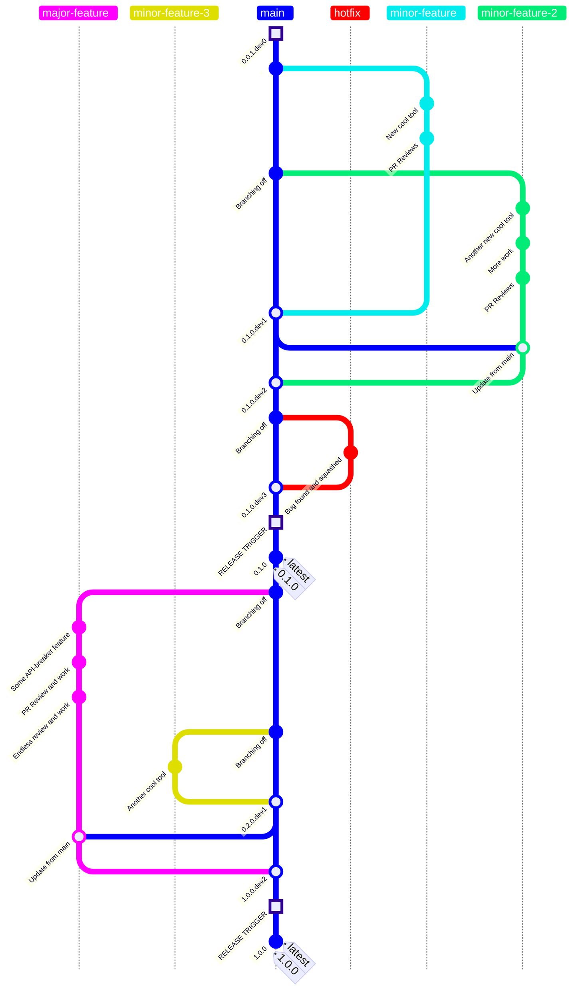

# Guideline to Workflow on Versioning and Release Management

## Brief Introduction
"Document your assumptions, document your processes, then apply them religiously. This will reduce conflicts on the team, reduce mistakes, and help you get more out of your tools." [Source](https://www.kalzumeus.com/2010/12/12/staging-servers-source-control-deploy-workflows-and-other-stuff-nobody-teaches-you/)

For an overview of ALL workflows - different environment workflows - in one go, please check a separate page [Overview](overview.md). Now for an overview on **versioning and release management** in GitHub, you've landed at the right place - here on this page.


## Visual Example Overview: Versioning and Release Management in Github

Before going to details in text further below, a short look at such graph below is strongly recommended. 😊

Please pay attention in the graph, to see how version on **`main`** branch is updated - when a branch is merged to to `main`, or when a `RELEASE TRIGGER` is activated. *Detailed descriptions can be found on this page further below.*




## Basic Overview

|                                               |                                                   |
|-----------------------------------------------|---------------------------------------------------|
| Type                                          | `Github Flow`                                     |
| Default & Protected Branch                    | `main`                                            |
| Destination Branch for all working branches   | `main`                                            |
| Versioning Type                               | Semantic Versioning (`SemVer`) <br>Versioning will be managed only on `main` branch.                    |
 Environments                                   | * `DEV` (Development), local only.<br> * `STAGING`, like PROD but no end users.<br> * `PROD` (Production), live and available to end users. <br>All these environments are strictly separated from each other, different sets of configurations and settings in each environment.                         |
| Which ones are for `DEV`-Environment          | Branch `main` or any feature/hotfix branch derived from `main` branch <br>This environment is **local only**, like GitHub Codespaces or user's VS Code. |
| Which ones are for `STAGING`-Environment          | Branch `main`<br>The `main` branch represents the latest code that developers work with before tagging a release. <br>This branch is always as deployable and as production-ready as possible. Preferably **same network** as `PROD`, behind firewall. |
| Which ones are for `PROD`-Environment?        | Tag `latest` or newest SemVer `x.y.z`-Tag. <br>Tag `latest` is always linked to newest SemVer `x.y.z`-Tag. <br> A release is identified by a tagged version. These tags are executed by release processes.   |
| Access to latest Branch in <br>`DEV`- and `STAGING`-Environments* | `git+https://${GH_PAT_FOR_PIP_INSTALLATIONS}@github.com/DataLab-BMWK/data_template_project_name.git@main`   |
| Access to latest Branch in `PROD`-Environment*| `git+https://${GH_PAT_FOR_PIP_INSTALLATIONS}@github.com/DataLab-BMWK/data_template_project_name.git@latest` |
| Release schedule                              | Release-**trigger** is done **manually**. <br>Script(s) will be used to execute the entire release process.|

<br>

```info
💡 *TODO: this is yet to be tested, assume a repository data_template_project_name already exists in virtual environment:
    * will reinstalling without `--force-reinstall` already suffice with newer `main` branch?
    * will reinstalling without `--force-reinstall` already suffice with even newer, replaced `latest` tag?
    * How to know if it has been reinstalled? Look at `pip list` for versions. This text block will be updated as more information is obtained.
```

## Versioning Overview

### Semantic Versioning

We use [semantic versioning](https://semver.org/), which means that we bump the

* `MAJOR` version (= the `x` for previous version `x.y.z`) when we make incompatible API changes.
* `MINOR` version (= the `y` for previos version `x.y.z`) when we add functionality in a backward compatible manner.
* `PATCH` version (= the `z` for previous version `x.y.z`) when we make backward compatible bug fixes.

### How to bump versions

When changing code, you will always have to do two things:

1. **Include at least one of the keywords below in the commit message of at least one commit.** Choose keywords based on your perception of the extent of changes you make to the code. Mind that you can only merge a Pull Request if at least one of your commits includes one of the required keywords.

| Level         | Keywords in Commit Message                | Example Commit Message                           |
|---------------|-------------------------------------------|--------------------------------------------------|
| `MAJOR`       | `MAJOR CHANGE`                            | `#53 MAJOR CHANGE introduced authentication module` |
|               | `BREAKING CHANGE`                         | `#53 BREAKING CHANGE get_data function now requires credentials as arguments` |
| `MINOR`       | `MINOR CHANGE`                            | `#12 MINOR CHANGE added optional argument pandas=True to get_data function` |
| `PATCH`       | `PATCH CHANGE`                            | `#45 PATCH CHANGE fixed issue where get_data failed on empty input` |
|               | `HOTFIX`                                  | `#37 HOTFIX temporarily fixed crash when parsing malformed CSV files` |
|               | `BUG FIX`                                 | `#29 BUG FIX resolved issue with incorrect date formatting in output` |


2. **Manually change (=bump) the `pyproject.toml` version accordingly**. Example:

* The `pyproject.toml` version is `0.7.2` when you start working on an issue.
* You make code changes: one commit is a `MINOR CHANGE`, another is a `BUG FIX`.
* The highest change level is `MINOR`, so you manually update the version in `pyproject.toml` to `0.8.0`.
* You’re now ready to open a Pull Request. Once approved in review, you’ll be eligible to merge.

```info
Eventually we want to automate step two, but for now it is a manual step you need to conduct yourself.
```

### DEV/STAGING & PROD Environments

|                               |                   |
|-------------------------------|-------------------|
| First version ever            | `0.0.1.dev0` <br>This is the initial version - either from template repository or initial commit.|
| First merged PR ever? <br>Or, first merged PR after release?       | Suffix `.dev1` is bumped or added. |
| Version in `DEV`- and `STAGING`-Environments  | Suffix `.devX` <br>`X` stands for `Xth Pull Request merged` to `main` <br>`x.y.z.devX`|
| Version in `PROD`-Environment | Suffix `.devX` is **dropped**. <br> `x.y.z`   |

### API-Compatibility Changes

* In general, version-decisions are based on changes since **last release**.
* For **first time release**, version-decisions are expected to be not major, but rather **minor** or **patch**.

In this table below, assume that `Xth Pull Request` has **just** been merged, it is now time to review if any compatibility changes have been made. This is to be done as fast as possible, especially just after PR merge, and on `main` branch.
| How big are changes since last release?   | Result                                    |
|-------------------------------------------|-------------------------------------------|
| `MAJOR CHANGE`, `BREAKING CHANGE`         | `x.y.z.devX` becomes `x+1.0.0.devX`       |
| `MINOR CHANGE`                            | `x.y.z.devX` becomes `x.y+1.0.devX`       |
| `PATCH CHANGE`, `HOTFIX`, `BUG FIX`           | `x.y.z.devX` becomes `x.y.z+1.devX`       |

Priorities of versioning:
* Any `MINOR CHANGE` overrules all other previous `PATCH CHANGE` since last release.
* Any `MAJOR CHANGE` overrules all other previous `MINOR CHANGE` or `PATCH CHANGE` since last release.


## Release Overview
Before going to the release trigger, there is one condition that humans must manually review in `STAGING`-Environment:
* Only latest `main` Branch is used
* Latest `main` Branch is deployed to `STAGING`-Environment (inside the firewall, for example).
* Human and/or robot review integration tests and interactios with all necessary services, including especially the `DATABASE` (in `STAGING`-Environment). Validate in `STAGING`.
* If any **FAIL** --> **DO NOT ACTIVATE RELEASE, HUMANS!**
* If all **PASS** --> Proceed to **release trigger**.

Once release has been triggered, these steps are expected:
* Only latest `main` Branch is used
* If this latest `main` is not newer than last release (all code identical, nothing new) --> **STOP RELEASE!**
* All necessary automated **tests** are executed. If **FAIL** --> **STOP RELEASE!**
* Drop `.devX` suffix from version (`x.y.z.devX` becomes `x.y.z`)
* Git commit `main` branch with changes <br><t> `git commit -am "RELEASE: Version changed from x.y.z.devX to x.y.z"`
* Push changes <br><t>`git push`
* Tag and push new version
```
git tag x.y.z
git push origin x.y.z
```
* Replace any pre-existing `latest`-Tag with newest version.
```
git tag -d latest               # Delete old latest tag
git tag latest x.y.z            # Create new latest tag and point it to the newest version
git push origin latest --force  # Force push the updated "latest" tag to remote
                                # Be careful to not do any other force pushes, except "latest" tag.
```
* Release complete 🚀 🔥

Now after successful release, and back to behind firewall, a human must execute this task:
* Deploy `latest`-Tag to `PROD`-Environment.
* Make sure the version deployed is newer than before. (Unsure if: `latest`-Tag needs extra considerations because of same name, force-update?)
* Make sure all works as exactly intended in `STAGING`-Environment.
* Ta-Da! 🚀 🔥


